Readme · MD
Copy

# 🫀 Heart Disease Prediction with Machine Learning & Explainable AI
 
> **Built a complete ML pipeline that predicts cardiovascular disease with 95.61% accuracy, then used Explainable AI (LIME + SHAP) to make the model's decisions transparent and interpretable for medical professionals.**
 


 
---
 
## 📌 Problem Statement
 
Cardiovascular diseases are the **#1 cause of death globally**. Early and accurate prediction can save lives — but black-box ML models aren't enough in healthcare. Doctors need to understand *why* a model flags a patient as high-risk. This project tackles both challenges: **high-accuracy prediction** and **model transparency**.
 
---
 
## 🔑 Key Highlights
 
| What I Did | Details |
|---|---|
| **Trained & compared 7 ML models** | Logistic Regression, Decision Tree, Random Forest, SVM, Naive Bayes, XGBoost, KNN |
| **Best accuracy: 95.61%** | K-Nearest Neighbors (k=3) with Precision: 0.97, Recall: 0.94, F1: 0.95 |
| **Explainable AI with LIME** | Local, per-patient explanations showing which features drive each prediction |
| **Explainable AI with SHAP** | Global feature importance + individual force plots using TreeExplainer on XGBoost |
| **Permutation Importance (eli5)** | Model-agnostic feature ranking with confidence intervals |
| **Ensemble model (Voting Classifier)** | Combined DT, LR, SVM, KNN, and RF via hard voting |
| **Comprehensive EDA** | 20+ visualizations covering distributions, correlations, and class balance |
 
---
 
## 🏗️ Project Architecture
 
```
📂 heart-disease-prediction-using-ML-and-XAI
│
├── cardio disease (2).ipynb    # Full pipeline: EDA → Preprocessing → Training → XAI
├── heart.csv                   # Dataset (1,025 records, 14 features)
├── images/                     # All visualizations used in this README
├── CSE_499-journal.pdf         # Research paper / journal article
├── CSE_499B-PROGRESSREPORT.pdf # Project progress report
└── README.md
```
 
---
 
## 📊 Dataset Overview
 
The dataset contains **1,025 patient records** with **13 clinical features** and a binary target variable. There are **zero missing values**, making it clean for direct modeling.
 
| Feature | Description | Type |
|---|---|---|
| `age` | Patient age in years | Numeric |
| `sex` | Gender (1 = Male, 0 = Female) | Categorical |
| `cp` | Chest pain type (0–3) | Categorical |
| `trestbps` | Resting blood pressure (mm Hg) | Numeric |
| `chol` | Serum cholesterol (mg/dl) | Numeric |
| `fbs` | Fasting blood sugar > 120 mg/dl | Binary |
| `restecg` | Resting ECG results (0–2) | Categorical |
| `thalach` | Maximum heart rate achieved | Numeric |
| `exang` | Exercise-induced angina | Binary |
| `oldpeak` | ST depression induced by exercise | Numeric |
| `slope` | Slope of peak exercise ST segment | Categorical |
| `ca` | Number of major vessels (0–4) | Categorical |
| `thal` | Thallium stress test result (0–3) | Categorical |
| **`target`** | **Heart disease (1 = Yes, 0 = No)** | **Binary** |
 
---
 
## 🔍 Exploratory Data Analysis (EDA)
 
### 1. Target Distribution — Is the dataset balanced?
 
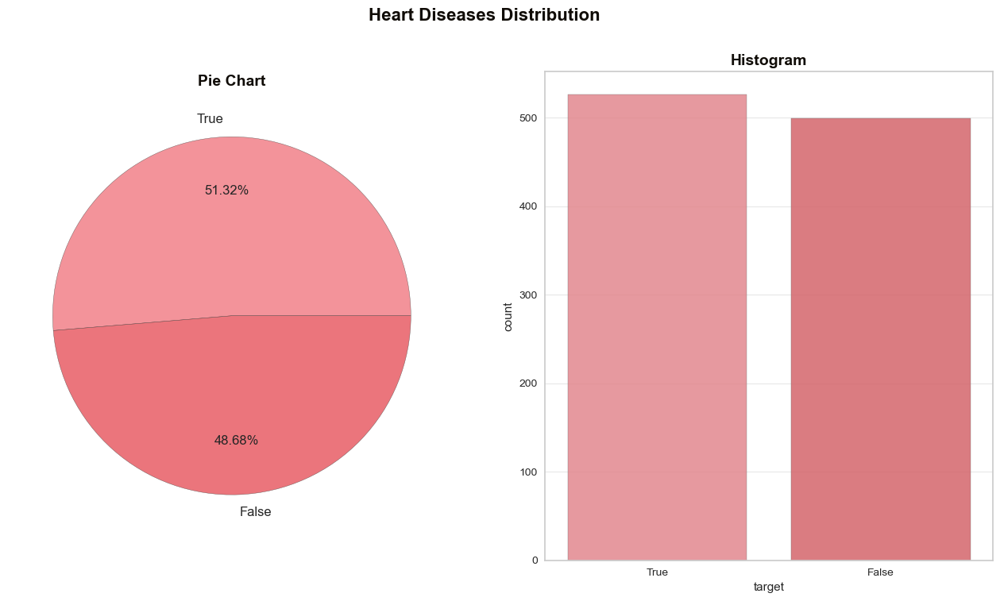
 
The dataset is **nearly perfectly balanced** — 526 patients (51.32%) have heart disease and 499 (48.68%) do not. This is ideal for classification because we don't need to worry about class imbalance techniques like SMOTE or weighted loss functions. The model can learn equally well from both classes without bias toward the majority.
 
---
 
### 2. Gender Distribution & Heart Disease by Gender
 
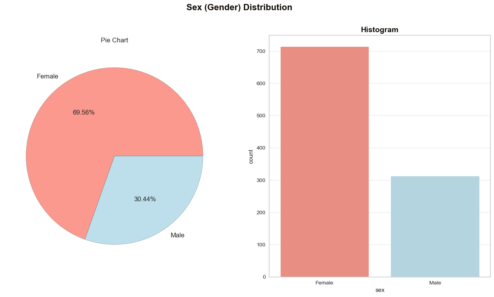
 
The dataset is skewed toward male patients (~68% vs ~32% female), which is typical in cardiac studies. But how does disease status split across genders?
 
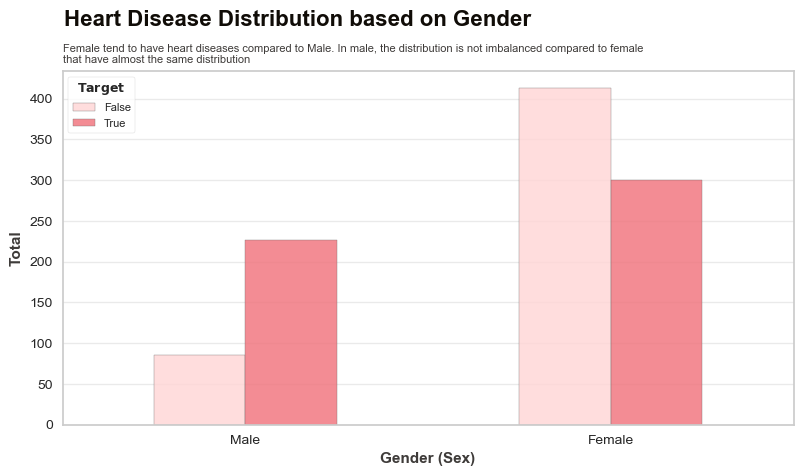
 
**Key finding:** Males show a more balanced split between disease and no-disease, while **females show a much higher proportion of heart disease cases** relative to their total count. This suggests that gender is a meaningful feature for the model, and female patients in this dataset carry elevated risk profiles.
 
---
 
### 3. Chest Pain Type — The Strongest Predictor
 
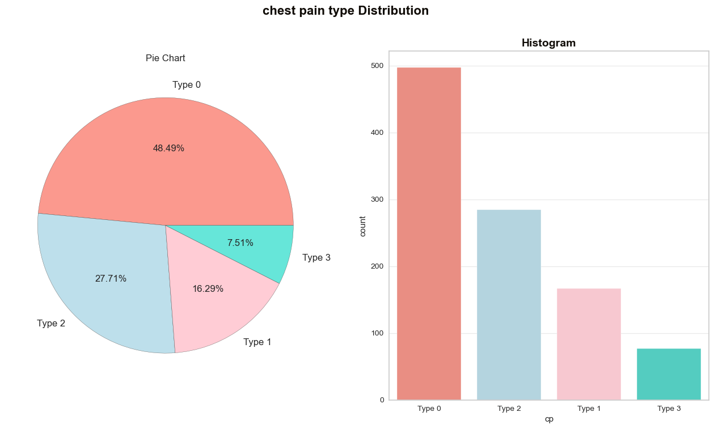
 
There are four types of chest pain in the dataset. Here's how they relate to disease status:
 
- **Type 0 — Typical Angina:** Patient has all 3 major angina symptoms
- **Type 1 — Atypical Angina:** Patient has 2 of 3 symptoms
- **Type 2 — Non-Anginal Pain:** Patient has 1 symptom
- **Type 3 — Asymptomatic:** No chest pain symptoms at all
 
The **Asymptomatic** group is clinically significant — these patients don't experience obvious chest pain but may still have heart disease, making ML-based early detection especially critical for them.
 
---
 
### 4. Continuous Feature Distributions
 
#### Age Distribution
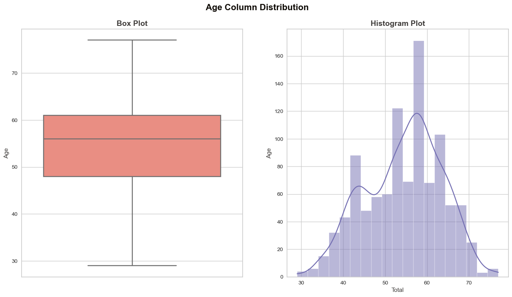
 
Both disease and no-disease groups span a similar age range (~30–75 years). The histogram shows the bulk of patients fall between **40–65 years**. The box plot reveals a few younger outliers, but age alone isn't a sufficient predictor — it needs to be combined with other features.
 
#### Resting Blood Pressure
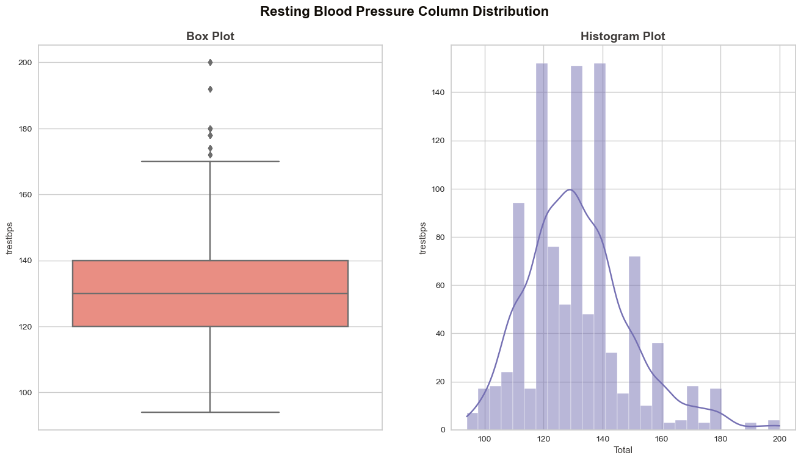
 
The distribution is roughly normal with most values between **110–150 mm Hg**. There are some outliers above 170, which could indicate hypertensive patients. Interestingly, blood pressure distributions look quite similar between disease groups.
 
#### Serum Cholesterol
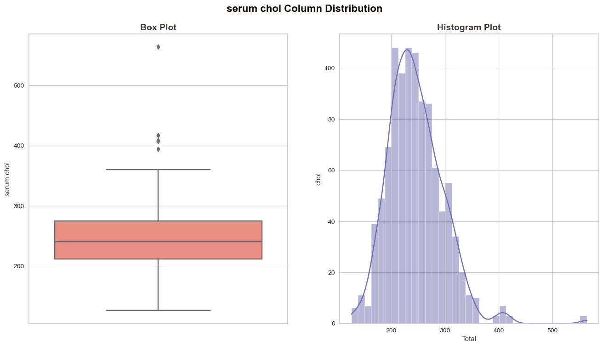
 
Most patients have cholesterol levels between **200–300 mg/dl**. There are extreme outliers above 400, but cholesterol shows surprisingly **weak correlation** with heart disease in this dataset, consistent with findings in several clinical studies.
 
#### Maximum Heart Rate
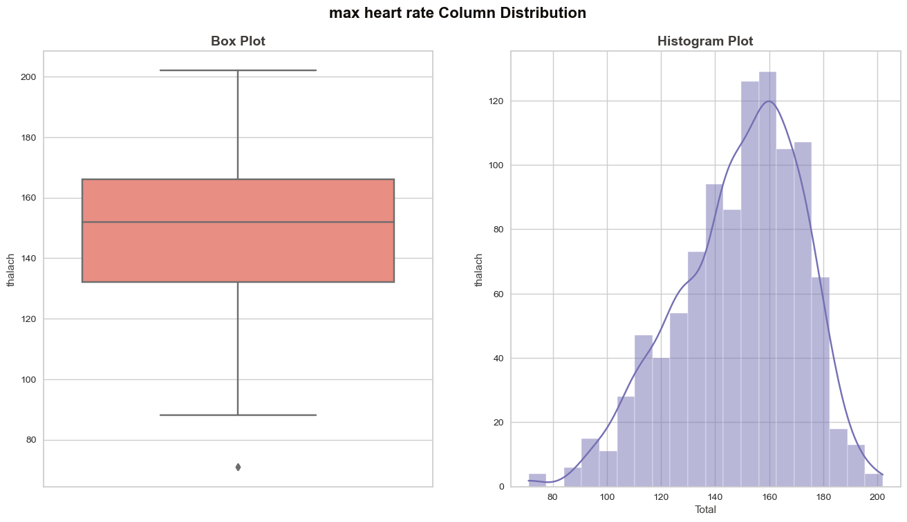
 
This feature shows clear differences between groups. **Disease patients tend to achieve higher maximum heart rates**, making `thalach` one of the more discriminative features (correlation: 0.42 with target).
 
#### ST Depression (Oldpeak)
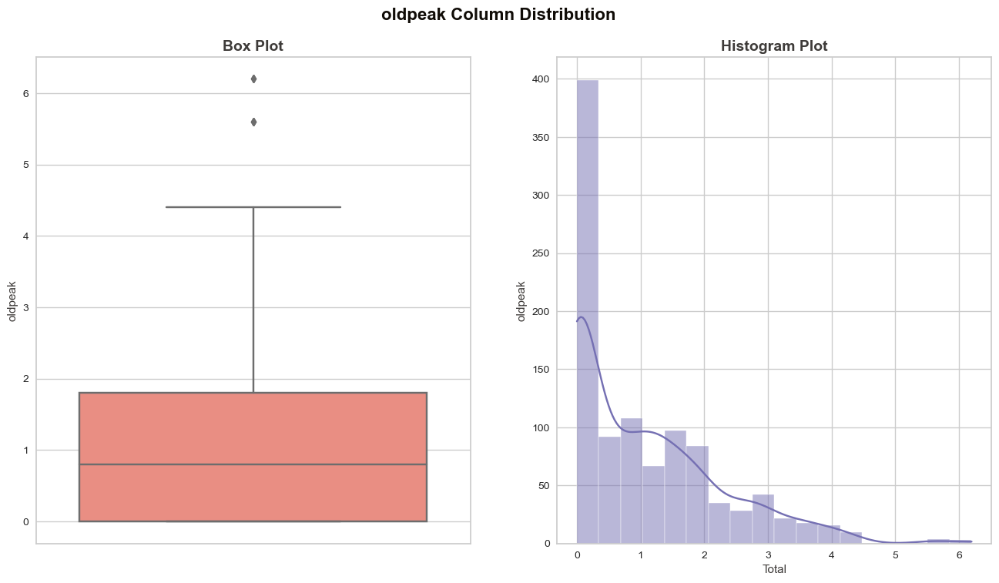
 
The `oldpeak` distribution is right-skewed, with most values near 0. Higher values indicate myocardial ischemia during exercise. This feature has a **strong negative correlation (-0.44) with the target**, making it one of the top predictors.
 
---
 
### 5. Exercise-Induced Angina
 
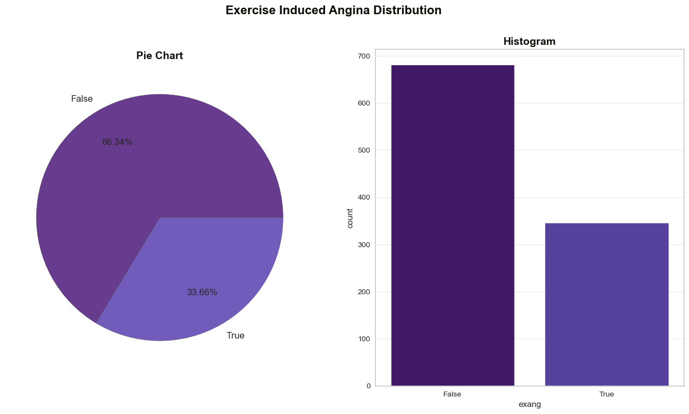
 
About **67% of patients do NOT experience exercise-induced angina**, while ~33% do. This binary feature is a useful signal — patients with exercise-induced angina may have compromised cardiac function during physical stress.
 
---
 
### 6. Number of Major Vessels (ca)
 
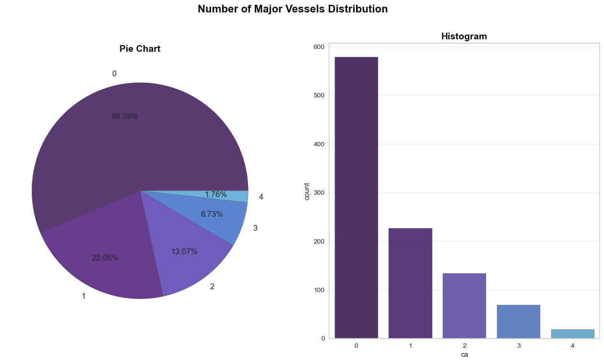
 
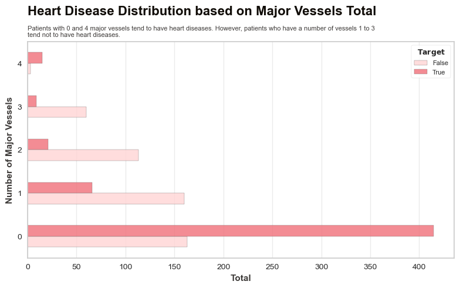
 
Patients with **0 major vessels colored by fluoroscopy** overwhelmingly have heart disease, while those with **1–3 vessels** are more likely to not have disease. The `ca` feature ranks as one of the **top-3 most important** features across all importance methods (eli5, SHAP, and Random Forest).
 
---
 
### 7. Thallium Stress Test (thal)
 
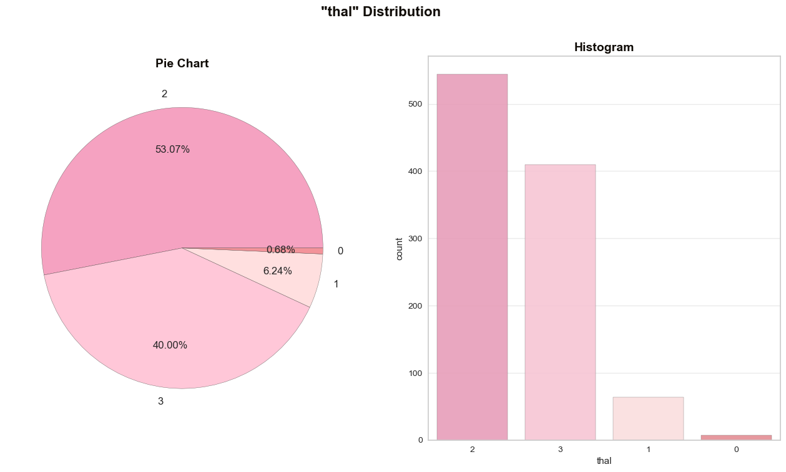
 
The thallium test checks blood supply to the heart using a radioactive tracer:
- **Type 0:** Normal results (no complications)
- **Type 1:** Fixed defect (permanent blockage)
- **Type 2:** Reversible defect (temporary blockage that redistributes)
- **Type 3:** Other
 
Type 2 (reversible defect) is the most common result in this dataset, followed by Type 3.
 
---
 
### 8. Additional Feature Distributions
 
| Feature | Visualization |
|---|---|
| **Fasting Blood Sugar** | 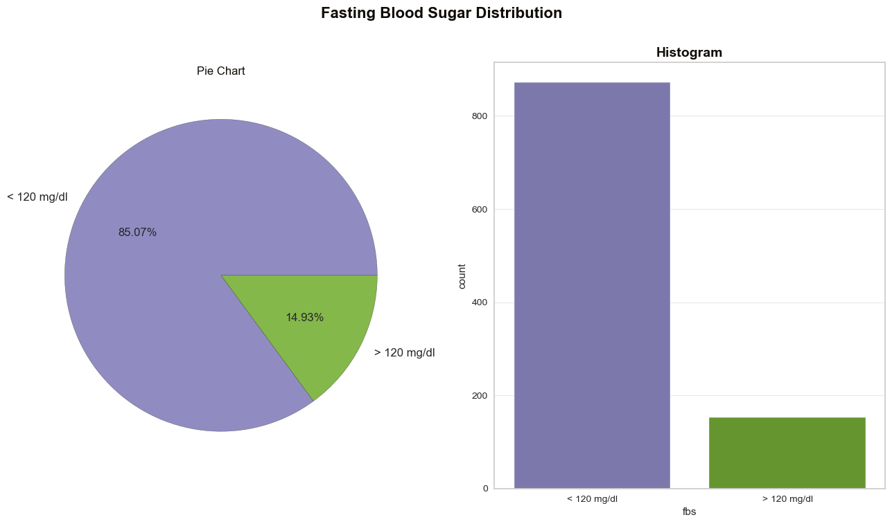 |
| **Resting ECG** | 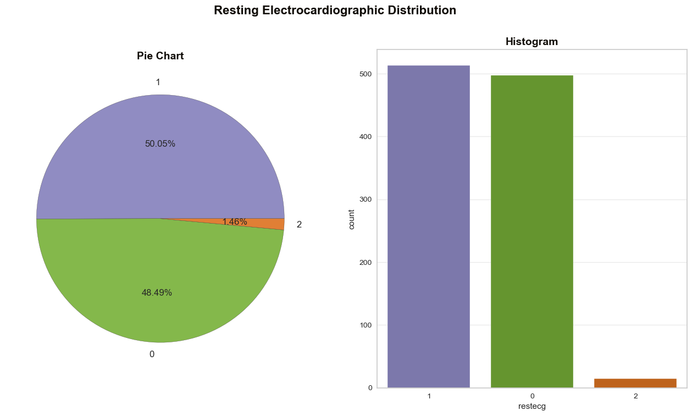 |
| **Slope of Peak Exercise** | 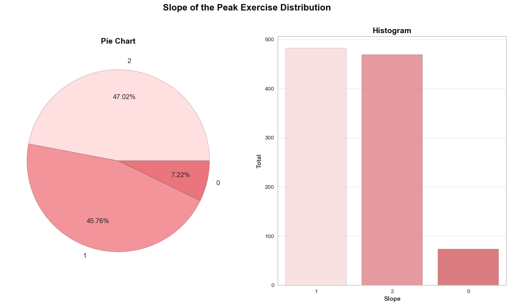 |
 
---
 
### 9. Correlation Matrix — How Features Relate
 
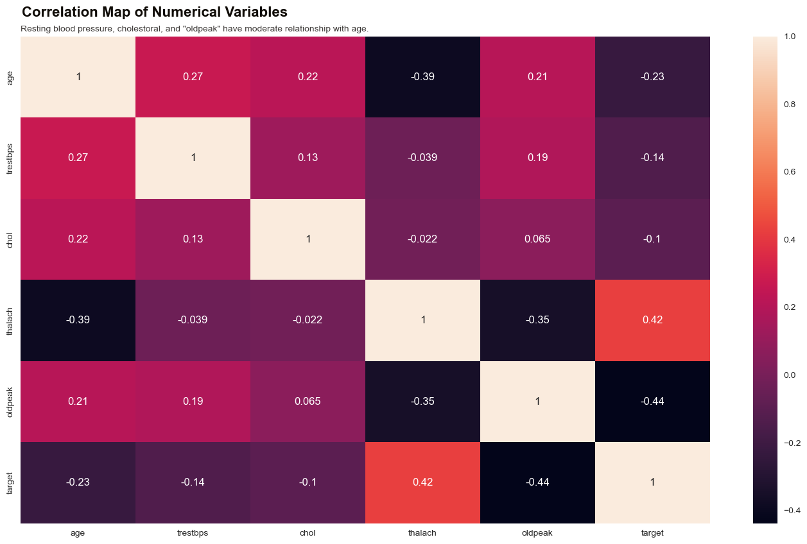
 
**Key correlations with the target (heart disease):**
- `thalach` (max heart rate) → **+0.42** — strongest positive correlation; higher heart rate associates with disease
- `oldpeak` (ST depression) → **-0.44** — strongest negative correlation; higher oldpeak associates with no disease
- `age` → **-0.23** — moderate negative correlation
- `chol` (cholesterol) → **-0.10** — surprisingly weak, despite common belief
 
**Inter-feature relationships:**
- `age` ↔ `trestbps`: +0.27 (blood pressure rises with age)
- `age` ↔ `thalach`: -0.39 (max heart rate drops with age)
- `thalach` ↔ `oldpeak`: -0.35 (inverse relationship between heart rate and ST depression)
 
---
 
## ⚙️ Methodology
 
### Data Preprocessing
1. **One-hot encoding** for multi-class categorical features (`cp`, `thal`, `slope`) — expanded to **21 features** total
2. **Min-Max normalization** to scale all features to [0, 1] range
3. **80/20 train-test split** (820 train / 205 test) with fixed random state for reproducibility
 
---
 
### Model Training & Evaluation
 
Seven classifiers were trained with tuned hyperparameters:
 
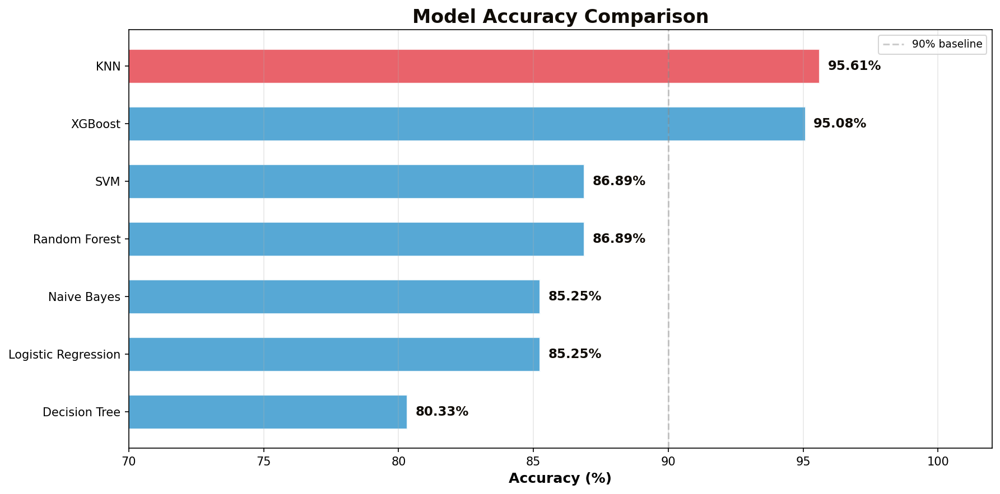
 
| Model | Accuracy | Key Hyperparameters |
|---|---|---|
| Decision Tree | 80.33% | `max_depth=3`, `criterion='entropy'`, `min_samples_leaf=5` |
| Naive Bayes | 82.44% | `var_smoothing=0.1` |
| Logistic Regression | 83.90% | `solver='liblinear'`, `penalty='l1'`, `max_iter=1000` |
| SVM | 83.90% | `kernel='linear'`, `C=10` |
| Random Forest | 86.89% | `n_estimators=1000`, `max_leaf_nodes=20` |
| XGBoost | 95.08% | `objective='binary:logistic'` |
| **KNN (Best)** | **95.61%** | **`n_neighbors=3`** |
 
**Why KNN outperformed:** KNN benefits from the Min-Max normalized feature space where the distance metric becomes meaningful. With k=3, it captures local patterns without overfitting, and the balanced dataset ensures no class bias.
 
Additionally, a **Voting Classifier** (hard voting) combined DT, LR, SVM, KNN, and RF to test ensemble performance.
 
---
 
### Confusion Matrices — Error Analysis
 
#### Logistic Regression
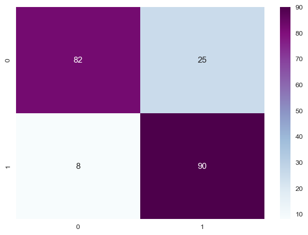
 
#### Naive Bayes
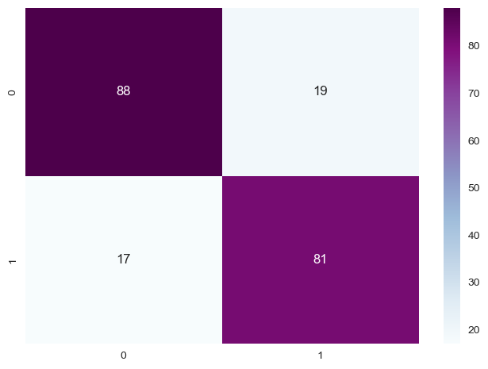
 
#### Decision Tree

 
#### Random Forest
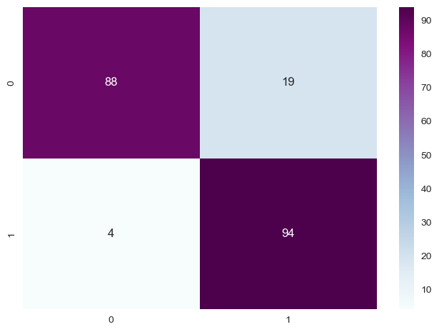
 
#### SVM
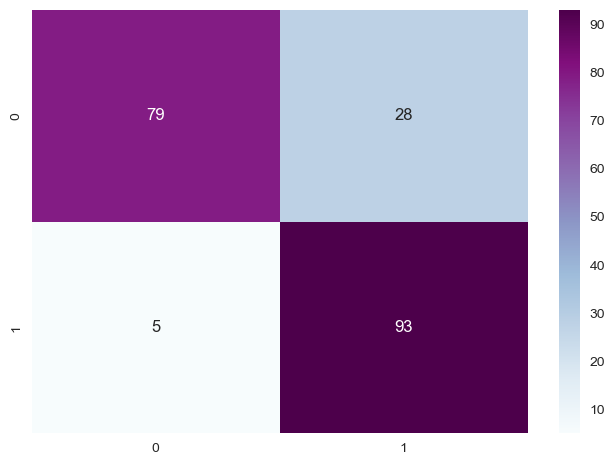
 
#### XGBoost

 
#### KNN (Best Model)
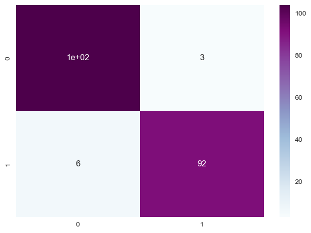
 
**What the confusion matrices reveal:**
- **KNN** has the tightest matrix — only **3 false positives** and **6 false negatives** out of 205 test samples
- **Random Forest** has a very low false negative rate (4), making it good at catching actual disease cases — but at the cost of more false positives
- **SVM** and **Naive Bayes** show higher misclassification rates overall
- In a medical context, **false negatives are more dangerous** (missing a real disease case), so KNN's balance of low errors in both directions makes it optimal
 
---
 
## 🧠 Explainable AI (XAI)
 
> **Why XAI matters:** In healthcare, a prediction alone isn't enough — clinicians need to know *which factors* are driving a diagnosis to trust and act on the model's output.
 
### Permutation Importance (eli5)
 
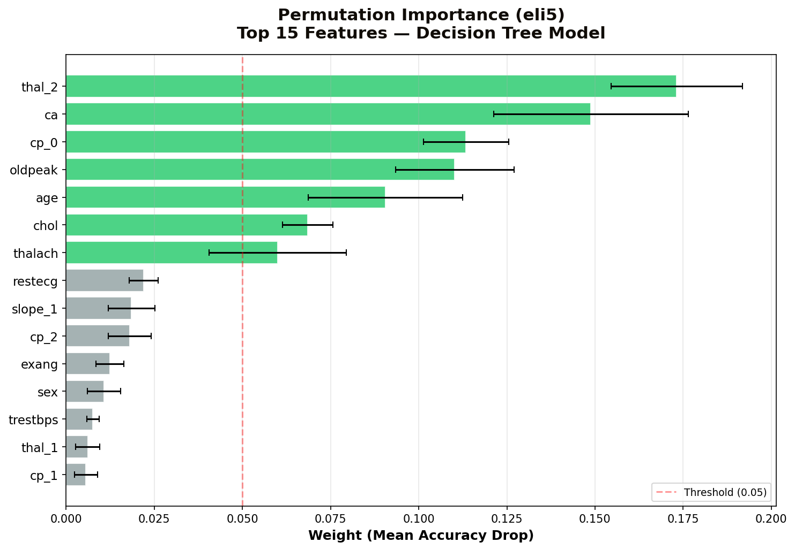
 
Permutation importance measures how much accuracy drops when a feature's values are randomly shuffled. The results clearly show:
 
1. **`thal_2` (Reversible Defect)** — Most important feature (weight: 0.173). Shuffling this feature causes the biggest accuracy drop
2. **`ca` (Major Vessels)** — Second most important (weight: 0.149). Blood flow through major vessels is critical for diagnosis
3. **`cp_0` (Typical Angina)** — Third most important (weight: 0.113). Chest pain type is a direct clinical indicator
4. **`oldpeak`** — Fourth (weight: 0.110). ST depression reflects myocardial ischemia
5. **`age`** — Fifth (weight: 0.091). Age is a general risk factor
 
Features below the 0.05 threshold (red line) — like `sex`, `trestbps`, `exang` — contribute less individually but may still add value in combination.
 
---
 
### LIME (Local Interpretable Model-agnostic Explanations)
 
LIME was applied to the **KNN model** to generate per-patient explanations using `LimeTabularExplainer` from the Skater library. For each individual prediction:
 
- LIME perturbs the input features and observes how the prediction changes
- It builds a simple, interpretable linear model around each specific patient
- The output shows which features pushed toward **"Disease"** vs. **"No Disease"** and by how much
 
This allows doctors to validate whether the model's reasoning aligns with clinical knowledge — for example, checking that `cp=0` (typical angina) and elevated `oldpeak` are flagged as dominant factors for a high-risk patient.
 
*LIME outputs are interactive HTML visualizations — run the notebook to explore individual patient explanations.*
 
---
 
### SHAP (SHapley Additive exPlanations)
 
SHAP was applied to the **XGBoost model** using `TreeExplainer` for mathematically exact Shapley values:
 
- **Summary bar plot** — global feature importance ranking across all test patients
- **Force plots** — individual prediction breakdowns showing how each feature shifts the output from the expected baseline
- **Beeswarm plot** — shows both importance *and* directionality (does a high value increase or decrease disease risk?)
 
*SHAP visualizations are interactive — run the notebook to explore force plots and summary plots.*
 
---
 
## 🧰 Tech Stack
 
| Category | Tools & Libraries |
|---|---|
| **Language** | Python 3.8+ |
| **Data Analysis** | Pandas, NumPy |
| **Visualization** | Matplotlib, Seaborn, Yellowbrick |
| **Machine Learning** | scikit-learn, XGBoost |
| **Explainability** | LIME (Skater), SHAP, eli5 |
| **Preprocessing** | MinMaxScaler, One-Hot Encoding |
| **Environment** | Jupyter Notebook |
 
---
 
## 🚀 Getting Started
 
### Prerequisites
- Python 3.8 or later
- Jupyter Notebook
 
### Installation
 
```bash
# Clone the repository
git clone https://github.com/UtshoData/heart-disease-prediction-using-ML-and-XAI.git
cd heart-disease-prediction-using-ML-and-XAI
 
# Install dependencies
pip install numpy pandas matplotlib seaborn scikit-learn xgboost yellowbrick lime shap eli5 skater
 
# Launch the notebook
jupyter notebook "cardio disease (2).ipynb"
```
 
---
 
## 📈 Results Summary
 
| Aspect | Result |
|---|---|
| Best Model | KNN (k=3) |
| Accuracy | **95.61%** |
| Precision (Disease) | 0.97 |
| Recall (Disease) | 0.94 |
| F1-Score | 0.95 |
| Top Features | `thal`, `ca`, `cp`, `oldpeak`, `age` |
| XAI Methods | LIME + SHAP + Permutation Importance (eli5) |
| Dataset | 1,025 records, 13 features, balanced classes |
 
---
 
## 🔮 Future Improvements
 
- Deploy as a web app using Flask/Streamlit for real-time predictions
- Experiment with deep learning models (neural networks)
- Test on larger, more diverse clinical datasets
- Add cross-validation and hyperparameter optimization (GridSearchCV / Optuna)
- Build an interactive SHAP dashboard for clinicians
 
---

## 📄 License

This project is open-source and available for academic and research purposes.

---

## 🙋 Author

**Utsho** — [GitHub Profile](https://github.com/UtshoData)

If you found this useful, consider giving the repo a ⭐!
