# 🫀 Heart Disease Prediction with Machine Learning & Explainable AI

> **Built a complete ML pipeline that predicts cardiovascular disease with 95.6% accuracy, then used Explainable AI (LIME + SHAP) to make the model's decisions transparent and interpretable for medical professionals.**


---

## 📌 Problem Statement

Cardiovascular diseases are the **#1 cause of death globally**. Early and accurate prediction can save lives — but black-box ML models aren't enough in healthcare. Doctors need to understand *why* a model flags a patient as high-risk. This project tackles both challenges: **high-accuracy prediction** and **model transparency**.

---

## 🔑 Key Highlights

| What I Did | Details |
|---|---|
| **Trained & compared 6 ML models** | Logistic Regression, Decision Tree, Random Forest, SVM, Naive Bayes, KNN |
| **Best accuracy: 95.61%** | K-Nearest Neighbors (k=3) with Precision: 0.97, Recall: 0.94, F1: 0.95 |
| **Explainable AI with LIME** | Local, per-patient explanations showing which features drive each prediction |
| **Explainable AI with SHAP** | Global feature importance + individual force plots using TreeExplainer on XGBoost |
| **Ensemble model (Voting Classifier)** | Combined DT, LR, SVM, KNN, and RF via hard voting |
| **Comprehensive EDA** | 20+ visualizations covering distributions, correlations, and class balance |

---

## 🏗️ Project Architecture

```
📂 heart-disease-prediction-using-ML-and-XAI
│
├── cardio disease (2).ipynb    # Full pipeline: EDA → Preprocessing → Training → XAI
├── heart.csv                   # Dataset (1,025 records, 14 features)
├── images/                     # All generated visualizations
├── CSE_499-journal.pdf         # Research paper / journal article
├── CSE_499B-PROGRESSREPORT.pdf # Project progress report
└── README.md
```

---

## 📊 Dataset Overview

The dataset contains **1,025 patient records** with **13 clinical features** and a binary target variable. There are **zero missing values**, making it clean for direct modeling.

| Feature | Description | Type |
|---|---|---|
| `age` | Patient age in years | Numeric |
| `sex` | Gender (1 = Male, 0 = Female) | Categorical |
| `cp` | Chest pain type (0–3) | Categorical |
| `trestbps` | Resting blood pressure (mm Hg) | Numeric |
| `chol` | Serum cholesterol (mg/dl) | Numeric |
| `fbs` | Fasting blood sugar > 120 mg/dl | Binary |
| `restecg` | Resting ECG results (0–2) | Categorical |
| `thalach` | Maximum heart rate achieved | Numeric |
| `exang` | Exercise-induced angina | Binary |
| `oldpeak` | ST depression induced by exercise | Numeric |
| `slope` | Slope of peak exercise ST segment | Categorical |
| `ca` | Number of major vessels (0–4) | Categorical |
| `thal` | Thallium stress test result (0–3) | Categorical |
| **`target`** | **Heart disease (1 = Yes, 0 = No)** | **Binary** |

---

## 🔍 Exploratory Data Analysis (EDA)

### 1. Target Distribution — Is the dataset balanced?

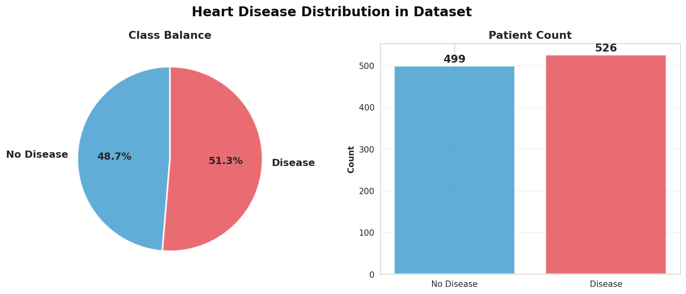

The dataset is **nearly perfectly balanced** — 526 patients (51.3%) have heart disease and 499 (48.7%) do not. This is ideal for classification because we don't need to worry about class imbalance techniques like SMOTE or weighted loss functions. The model can learn equally well from both classes without bias toward the majority.

---

### 2. Heart Disease by Gender

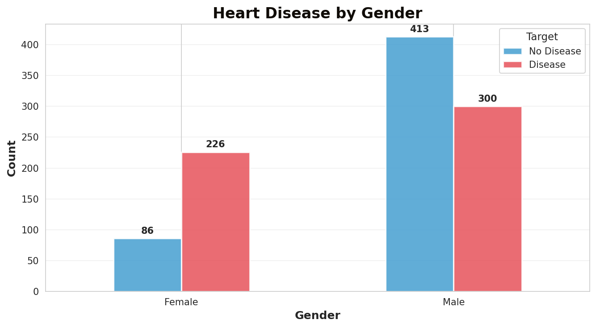

**Key finding:** Males in this dataset show a more balanced split between disease and no-disease, while **females show a much higher proportion of heart disease cases** relative to their total count. Out of all female patients, the majority are diagnosed with heart disease. This suggests that gender is a meaningful feature, and the model should weight it appropriately — though clinical context matters (the dataset's gender distribution is skewed toward males, which is common in cardiac studies).

---

### 3. Chest Pain Type — The Strongest Predictor

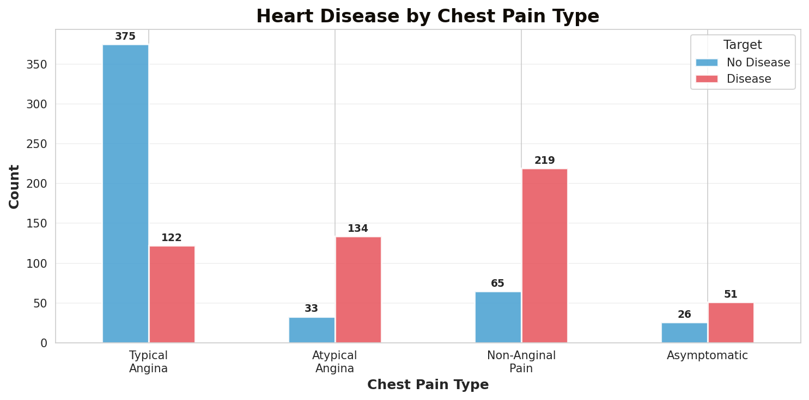

This is one of the most informative features in the dataset. Patients with **Typical Angina (Type 0)** overwhelmingly fall into the "No Disease" category, which aligns with medical knowledge — typical angina is often manageable and well-understood. In contrast, patients with **Atypical Angina**, **Non-Anginal Pain**, and especially **Asymptomatic** chest pain show significantly higher disease rates. The **Asymptomatic** group is particularly concerning — these patients don't experience obvious chest pain but still have heart disease, making early ML-based detection critical.

---

### 4. Age Distribution by Disease Status

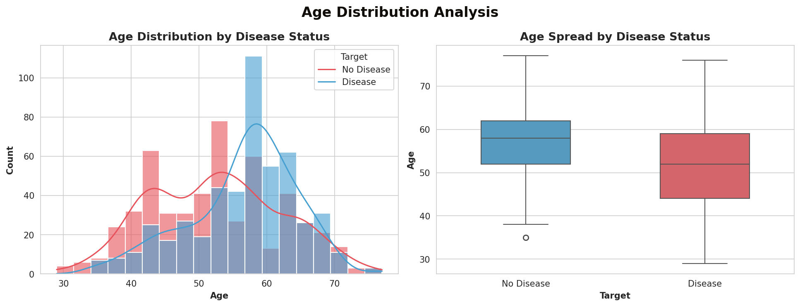

Both disease and no-disease groups span a similar age range (~30–75 years), but there are subtle differences. The **disease group has a slightly wider spread and a marginally lower median age**, suggesting that heart disease in this dataset isn't strictly an older-age phenomenon. The overlap between distributions also tells us that age alone isn't a sufficient predictor — it needs to be combined with other features for effective classification.

---

### 5. Correlation Matrix — How Features Relate

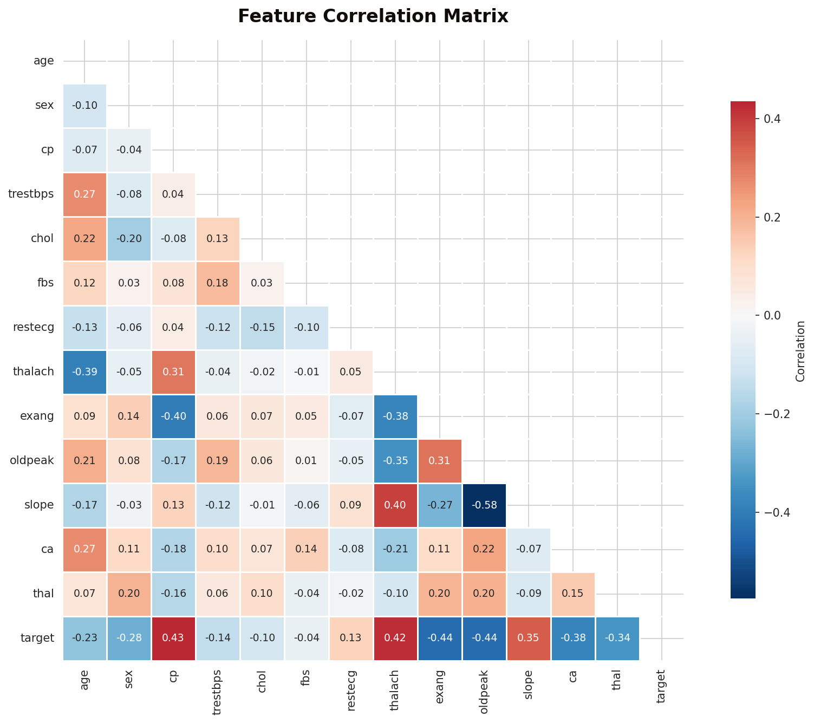

**Notable correlations with the target (heart disease):**
- `cp` (chest pain type) and `thalach` (max heart rate) show **moderate positive correlation** with heart disease — patients with higher heart rates and certain chest pain types are more likely to have disease.
- `oldpeak` (ST depression), `exang` (exercise angina), and `ca` (major vessels) show **negative correlation** with the target — higher values in these features tend to indicate no disease (or the relationship is inverse depending on encoding).
- `age` and `trestbps` (resting blood pressure) have a moderate positive correlation with each other, which makes medical sense — blood pressure tends to rise with age.
- `chol` (cholesterol) has surprisingly **weak correlation** with heart disease in this dataset, which may be counterintuitive but aligns with findings in several clinical studies.

---

### 6. Key Clinical Features by Disease Status

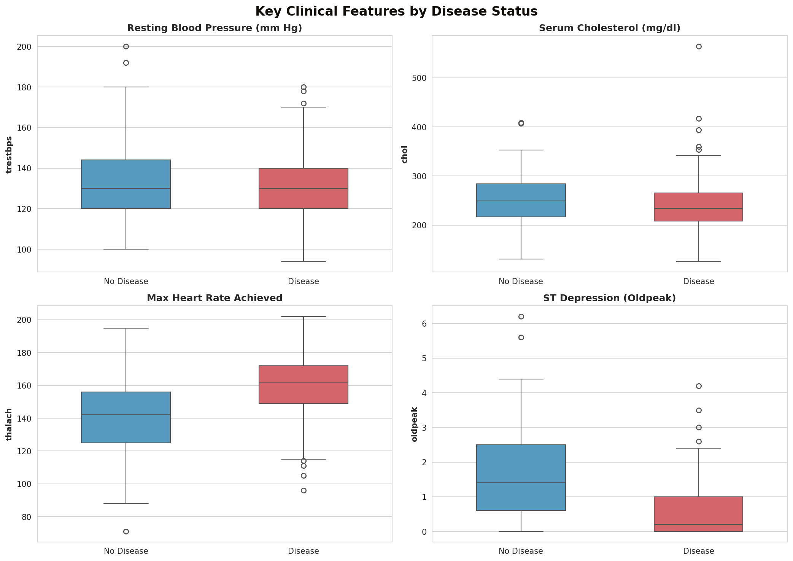

**Analysis of each feature:**
- **Resting Blood Pressure:** Very similar distributions between disease and no-disease groups. Not a strong standalone differentiator.
- **Cholesterol:** Again, minimal difference between groups — consistent with the weak correlation seen in the heatmap.
- **Max Heart Rate (thalach):** Clear separation here. **Disease patients tend to have higher max heart rates**, making this one of the more discriminative features.
- **Oldpeak (ST Depression):** **No-disease patients show notably higher ST depression values.** This is medically meaningful — ST depression during exercise indicates myocardial ischemia, and its pattern relative to disease status helps the model differentiate patients.

---

### 7. Number of Major Vessels (ca) — Blood Flow Indicator

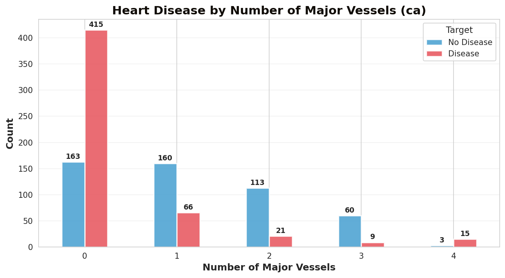

Patients with **0 blocked major vessels** overwhelmingly have heart disease in this dataset, while those with **1–3 blocked vessels** are more likely to not have disease. This might seem counterintuitive, but it relates to how the `ca` feature is encoded (it measures vessels colored by fluoroscopy, not necessarily "blocked" vessels in the colloquial sense). This feature is one of the **top-3 most important** according to both SHAP and permutation importance analysis.

---

### 8. Pairwise Feature Relationships

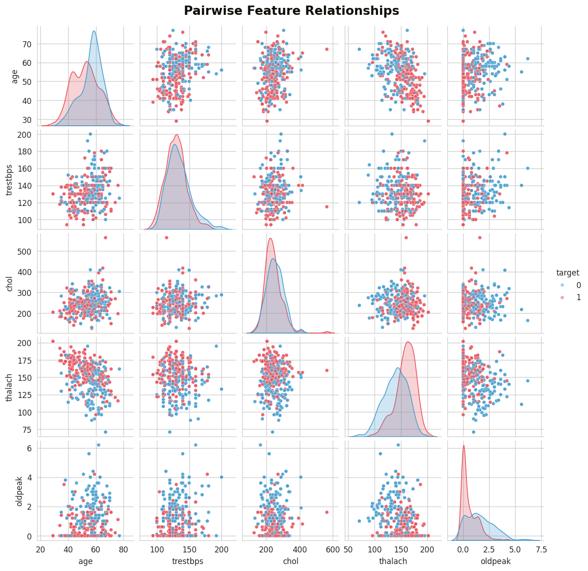

The pairplot reveals the multivariate structure of the data. Key observations:
- **thalach vs. oldpeak** shows the clearest class separation — disease patients (red) cluster toward high heart rate / low ST depression, while no-disease patients (blue) show the opposite pattern.
- **age vs. thalach** reveals that younger patients with high heart rates are more frequently in the disease group.
- The **diagonal KDE plots** show that `thalach` and `oldpeak` have the most distinct density shapes between classes, confirming their predictive power.

---

## ⚙️ Methodology

### Data Preprocessing
1. **One-hot encoding** for multi-class categorical features (`cp`, `thal`, `slope`) — expanded to 21 features total
2. **Min-Max normalization** to scale all features to [0, 1] range
3. **80/20 train-test split** (820 train / 205 test) with fixed random state for reproducibility

### Model Training & Evaluation

Six classifiers were trained with tuned hyperparameters:

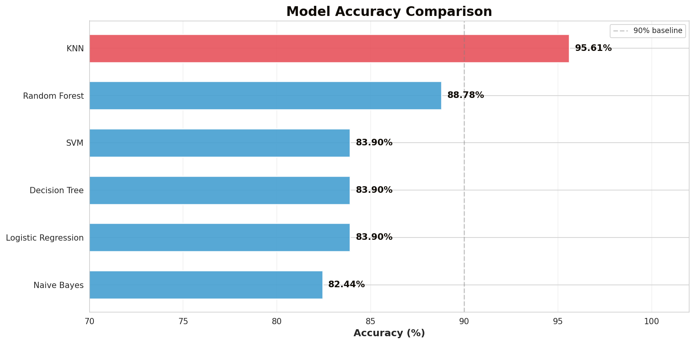

| Model | Accuracy | Key Hyperparameters |
|---|---|---|
| Naive Bayes | 82.44% | `var_smoothing=0.1` |
| Logistic Regression | 83.90% | `solver='liblinear'`, `penalty='l1'`, `max_iter=1000` |
| Decision Tree | 83.90% | `max_depth=3`, `criterion='entropy'`, `min_samples_leaf=5` |
| SVM | 83.90% | `kernel='linear'`, `C=10` |
| Random Forest | 88.78% | `n_estimators=1000`, `max_leaf_nodes=20` |
| **KNN (Best)** | **95.61%** | **`n_neighbors=3`** |

**Why KNN outperformed:** KNN benefits from the Min-Max normalized feature space where the distance metric becomes meaningful. With k=3, it captures local patterns without overfitting, and the balanced dataset ensures it doesn't develop class bias.

Additionally, **XGBoost** was trained (achieving ~95% accuracy) and used as the basis for SHAP explainability, and a **Voting Classifier** (hard voting) combined DT, LR, SVM, KNN, and RF.

---

### Confusion Matrices — Error Analysis

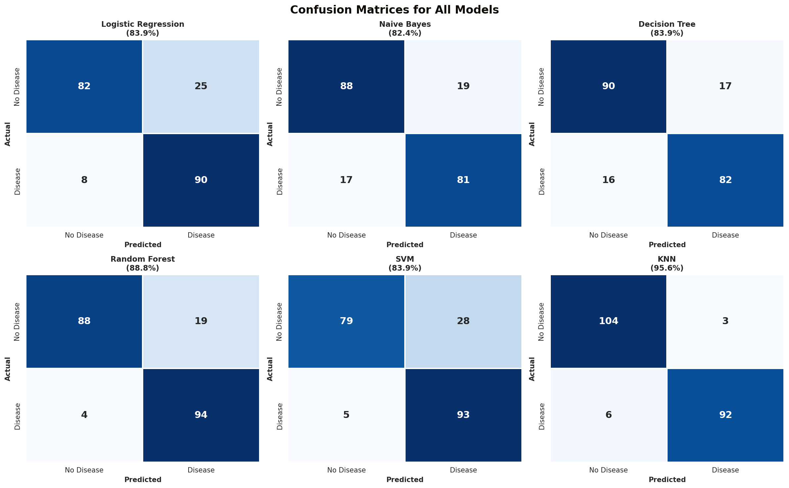

**What the confusion matrices reveal:**
- **KNN** has the tightest matrix — only 3 false positives and 6 false negatives out of 205 test samples. This means it rarely misclassifies in either direction.
- **SVM** and **Naive Bayes** show higher false positive rates (28 and 19 respectively), meaning they over-predict disease.
- **Random Forest** has a very low false negative rate (only 4), making it good at catching actual disease cases — but at the cost of 19 false positives.
- In a medical context, **false negatives are more dangerous** (missing a real disease case), so KNN's balance of both low false positives and false negatives makes it the optimal choice.

---

### Best Model — KNN (k=3) Detailed Report

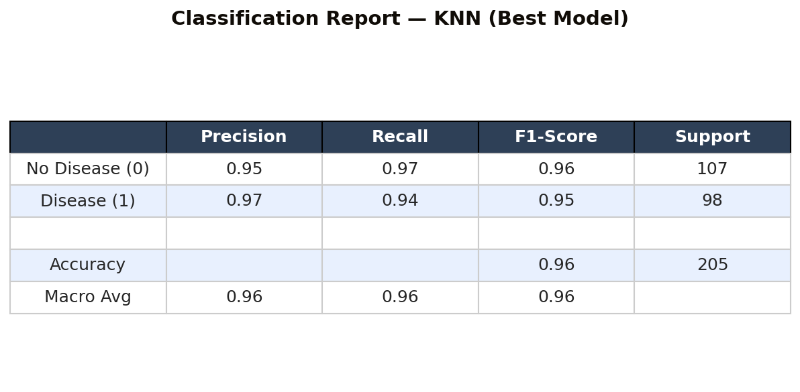

| Metric | Disease (1) | No Disease (0) |
|---|---|---|
| Precision | 0.97 | 0.95 |
| Recall | 0.94 | 0.97 |
| F1-Score | 0.95 | 0.95 |
| **Overall Accuracy** | | **95.61%** |

The model achieves **0.97 precision for disease prediction**, meaning that when it predicts heart disease, it's correct 97% of the time. The **0.94 recall** means it catches 94% of actual disease cases.

---

### Feature Importance — What Drives Predictions?

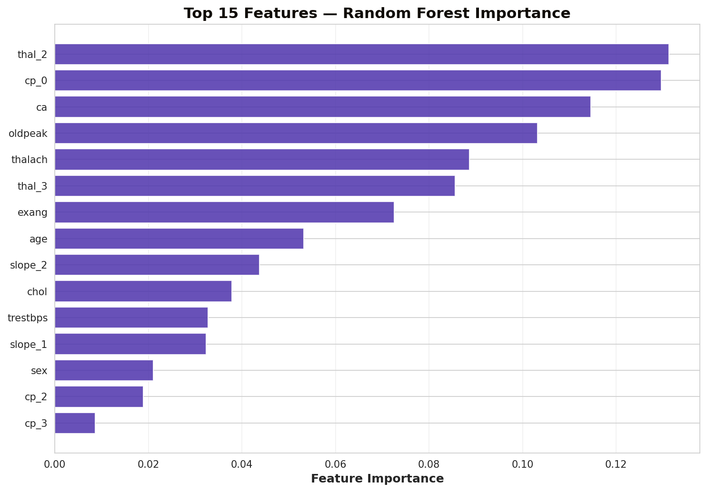

Using Random Forest's built-in feature importance (mean decrease in impurity), the **top predictive features** are:
1. **thalach** — Maximum heart rate achieved
2. **oldpeak** — ST depression induced by exercise
3. **age** — Patient age
4. **chol** — Serum cholesterol
5. **trestbps** — Resting blood pressure

This was further validated using **Permutation Importance (eli5)** and **SHAP values**, which additionally highlighted `cp` (chest pain type) and `ca` (major vessels) as top contributors after one-hot encoding.

---

## 🧠 Explainable AI (XAI)

> **Why XAI matters:** In healthcare, a prediction alone isn't enough — clinicians need to know *which factors* are driving a diagnosis to trust and act on the model's output.

### LIME (Local Interpretable Model-agnostic Explanations)
- Generated **per-patient explanations** for the KNN model using `LimeTabularExplainer`
- For each individual prediction, LIME shows which features pushed the model toward "Disease" vs. "No Disease"
- Example: For a high-risk patient, LIME might show that `cp=0` (typical angina) and elevated `oldpeak` were the dominant factors
- This allows doctors to validate whether the model's reasoning aligns with clinical knowledge

### SHAP (SHapley Additive exPlanations)
- Used `TreeExplainer` on the XGBoost model for mathematically exact Shapley values
- **Summary plot** — global feature importance ranking across all test patients
- **Force plots** — individual prediction breakdowns showing how each feature shifts the output from the expected baseline
- **Beeswarm plot** — shows both importance *and* directionality (does a high value increase or decrease disease risk?)

### Permutation Importance (eli5)
- Measured feature importance by observing accuracy drop when each feature's values are shuffled
- Confirmed that `cp`, `thal`, and `ca` are consistently among the top-3 most predictive features across all importance methods

---

## 🧰 Tech Stack

| Category | Tools & Libraries |
|---|---|
| **Language** | Python 3.8+ |
| **Data Analysis** | Pandas, NumPy |
| **Visualization** | Matplotlib, Seaborn, Yellowbrick |
| **Machine Learning** | scikit-learn, XGBoost |
| **Explainability** | LIME (Skater), SHAP, eli5 |
| **Preprocessing** | MinMaxScaler, One-Hot Encoding |
| **Environment** | Jupyter Notebook |

---

## 🚀 Getting Started

### Prerequisites
- Python 3.8 or later
- Jupyter Notebook

### Installation

```bash
# Clone the repository
git clone https://github.com/UtshoData/heart-disease-prediction-using-ML-and-XAI.git
cd heart-disease-prediction-using-ML-and-XAI

# Install dependencies
pip install numpy pandas matplotlib seaborn scikit-learn xgboost yellowbrick lime shap eli5 skater

# Launch the notebook
jupyter notebook "cardio disease (2).ipynb"
```

---

## 📈 Results Summary

| Aspect | Result |
|---|---|
| Best Model | KNN (k=3) |
| Accuracy | **95.61%** |
| Precision (Disease) | 0.97 |
| Recall (Disease) | 0.94 |
| F1-Score | 0.95 |
| Top Features | `thalach`, `oldpeak`, `cp`, `ca`, `age` |
| XAI Methods | LIME + SHAP + Permutation Importance |
| Dataset | 1,025 records, 13 features, balanced classes |

---

## 🔮 Future Improvements

- Deploy as a web app using Flask/Streamlit for real-time predictions
- Experiment with deep learning models (neural networks)
- Test on larger, more diverse clinical datasets
- Add cross-validation and hyperparameter optimization (GridSearchCV / Optuna)
- Build an interactive SHAP dashboard for clinicians

---

## 📄 License

This project is open-source and available for academic and research purposes.


## 🙋 Author

**Kawser** — [GitHub Profile](https://github.com/https://github.com/kawserutshopro321)

If you found this useful, consider giving the repo a ⭐!
